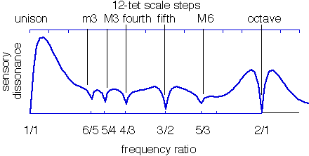

# Harmonic Dissonance Curve creator & visualizer

[p5.js](https://p5js.org/) sketch for creating and visualizing harmonic dissonance curves

## What is a dissonance curve?

It is generally agreed that if you double the frequency of a pitched sound (for example, a piano note) you'll get something we perceive as the same note, only an octave higher. However, these phenomena are highly dependent on the timber of the sound. Most musical sound sources are harmonic, that is to say, their overtones follow the [harmonic series](<https://en.wikipedia.org/wiki/Harmonic_series_(music)>) (_f_, _f_ \* 2, _f_ \* 3, _f_ \* 4, _f_ \* 5...). For these sounds, the usual octave (doubling the frequency) still holds up, but as we move into [inharmonic sounds](https://en.wikipedia.org/wiki/Inharmonicity) (those that don't follow that overtone pattern), we can trick our ears to perceive, as the same note, two sounds that don't have this 1:2 ratio.

A **dissonance curve**, as presented in Sethares' book [Tuning, Timbre, Spectrum, Scale](https://sethares.engr.wisc.edu/ttss.html), is a representation of how dissonant any given interval is, based on a sound. This can give us clues as to what intervals are perceived as more consonant than others, and what scales might be suitable then.

You can see below an example from Sethares' book using a simple harmonic sound.

## What is this sketch?

This repository contains the relevant files for a p5.js sketch to create a dissonance curve from a given sound, on the fly, using JavaScript. Currently, it's usable but still WIP, as I add more features:

-   [x] create a curve from a sound
-   [x] better visualization
-   [x] more sound examples (maybe the user could upload a sound to analyze?)
-   [ ] create a scale base on the curve
-   [x] simple keyboard to play the scale
-   [ ] visualize keyboard on the curve
-   [ ] change keyboard tuning
